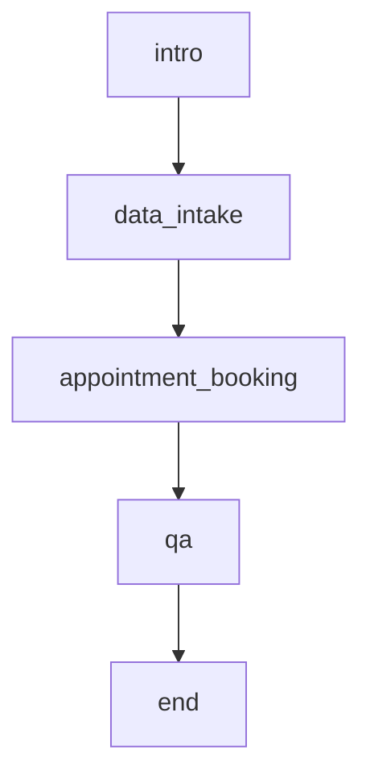

# Healthcare Intake & Scheduling

A scenario tutorial for Akapulu Labs. The avatar acts as a friendly medical
screening assistant: it collects intake details, looks at the patient's camera
on request (vision), books an appointment through HTTP endpoints, and answers
clinic questions from a knowledge base (RAG).

This repo holds only the scenario assets — the mock endpoint server, the
knowledge base document, and the scenario JSON. To run a live call, pair it
with one of the Web SDK example apps:

- [`prebuilt-ui`](https://github.com/Akapulu/prebuilt-ui)
- [`prebuilt-ui-styled`](https://github.com/Akapulu/prebuilt-ui-styled)
- [`customized-ui`](https://github.com/Akapulu/customized-ui)

## Node graph



| Node | What it does | Tools |
|---|---|---|
| `intro` | Greet the patient and get consent | transition |
| `data_intake` | Collect name, age, reason, symptoms | transition, vision |
| `appointment_booking` | Fetch slots and book an appointment | http |
| `qa` | Answer clinic questions | transition, rag |
| `end` | Wrap up and end the call | — |

## Prerequisites

- **Python 3** (for the mock endpoint server)
- **ngrok** — <https://ngrok.com/docs/guides/share-localhost/quickstart>
- An **Akapulu account** — <https://akapulu.com>

---

## Setup

### 1) Clone the repo

```bash
git clone https://github.com/Akapulu/healthcare-intake-scheduling.git && cd healthcare-intake-scheduling
```

### 2) Run the mock endpoint server

The `appointment_booking` node calls two HTTP endpoints. This repo ships a small
Flask server (`mock-server/flask-server.py`) that returns fake availability and
booking confirmations:

- `POST /get-availability` — returns available appointment slots
- `POST /book-appointment` — returns a generated confirmation id

Create a virtual environment and install Flask:

```bash
python3 -m venv flask-venv && source flask-venv/bin/activate && pip install flask
```

Start the server on `localhost:8080`. Leave this terminal open:

```bash
cd mock-server && python flask-server.py
```

### 3) Expose the server with ngrok

Akapulu calls your endpoints over the internet during a live call, so the local
server needs a public HTTPS URL. We use ngrok's free **dev domain**, which stays
the same across restarts — so you don't have to re-edit your endpoint URLs every
time you start the tunnel.

#### a) Create an ngrok account

Sign up at [dashboard.ngrok.com/signup](https://dashboard.ngrok.com/signup).

#### b) Install ngrok

On macOS:

```bash
brew install ngrok
```

#### c) Connect your account

Copy your authtoken from
[dashboard.ngrok.com/get-started/your-authtoken](https://dashboard.ngrok.com/get-started/your-authtoken),
then add it to the agent:

```bash
ngrok config add-authtoken <YOUR_AUTHTOKEN>
```

#### d) Copy your dev domain

Every account gets one free dev domain (ends in `.ngrok-free.dev`). Open
[dashboard.ngrok.com/domains](https://dashboard.ngrok.com/domains) and copy your
assigned `https://<YOUR_DEV_DOMAIN>`.

#### e) Start the tunnel

Keep the Flask server running, then in a **second** terminal forward your dev
domain to port `8080`:

```bash
ngrok http 8080 --url https://<YOUR_DEV_DOMAIN>
```

Use this same dev domain in the endpoint URLs below, replacing
`<YOUR_NGROK_DOMAIN>`.

### 4) Create the secret

Go to [akapulu.com/secrets](https://akapulu.com/secrets) and create:

- Name: `webhook_token`
- Example value: `webhook_secret_123`

### 5) Create the endpoints

Create two endpoints at [akapulu.com/endpoints](https://akapulu.com/endpoints)
(**Create Endpoint**). Use your ngrok domain in each URL.

For field syntax, see [templates and variables](https://docs.akapulu.com/guides/endpoints/templates-and-variables).

#### Patient Intake Get Availability

- URL: `https://<YOUR_NGROK_DOMAIN>/get-availability`
- Method: `POST`

Headers:

```json
{
  "Content-Type": "application/json",
  "X-Patient-ID": "{{runtime.patient_id}}",
  "Authorization": "Bearer {{secret.webhook_token}}"
}
```

Body:

```json
{
  "preferred_date": "{{llm.preferred_date:Preferred date or start of range in YYYY-MM-DD}}",
  "appointment_type": "{{llm.appointment_type:Type like follow_up or new_consult}}",
  "patient_id": "{{runtime.patient_id}}"
}
```

#### Patient Intake Book Appointment

- URL: `https://<YOUR_NGROK_DOMAIN>/book-appointment`
- Method: `POST`

Headers:

```json
{
  "Content-Type": "application/json",
  "X-Patient-ID": "{{runtime.patient_id}}",
  "Authorization": "Bearer {{secret.webhook_token}}"
}
```

Body:

```json
{
  "date": "{{llm.date:Appointment date in YYYY-MM-DD}}",
  "time": "{{llm.time:Appointment time in HH:MM 24-hour}}",
  "appointment_type": "{{llm.appointment_type:Type like follow_up or new_consult}}",
  "patient_id": "{{runtime.patient_id}}",
  "source": "patient_intake_screening"
}
```

### 6) Create the knowledge base

Go to [akapulu.com/knowledge-bases](https://akapulu.com/knowledge-bases) and
click **Create**:

- Name: `Healthcare Intake Demo Knowledge Base`

Open it, click **Add Document**, and upload:

- `knowledge-base/Clinic-Details.md`

### 7) Create the scenario

Go to [akapulu.com/scenarios](https://akapulu.com/scenarios), click **Create
Scenario**, name it (e.g. `Healthcare Intake & Scheduling Demo`), and switch the
editor to **JSON** mode.

Paste in the contents of [`scenario.json`](./scenario.json), then replace the
placeholder IDs with the ones you just created:

- `<YOUR_GET_AVAILABILITY_ENDPOINT_ID>`
- `<YOUR_BOOK_APPOINTMENT_ENDPOINT_ID>`
- `<YOUR_ABOUT_OUR_CLINIC_KNOWLEDGE_BASE_ID>`

Click **Save** and copy your new **scenario id**.

---

## Use in UI

After your scenario is saved, pick a Web SDK example repo and set your
`scenario_id` plus runtime vars in `backend/server.ts`:

- [prebuilt-ui](https://github.com/Akapulu/prebuilt-ui) — minimal `AkapuluConversation` demo
- [prebuilt-ui-styled](https://github.com/Akapulu/prebuilt-ui-styled) — styled prebuilt UI + post-call review
- [customized-ui](https://github.com/Akapulu/customized-ui) — custom hooks + Daily video UI + post-call review

Example connect payload:

```ts
const connectPayload = {
  scenario_id: "<your-scenario-id>",
  avatar_id: "f77de1e5-6ce3-448c-8cff-a8cc3c8a50bf",
  runtime_vars: {
    patient_id: "patient_001",
    today: new Date().toISOString().slice(0, 10),
  },
  record_conversation: true,
};
```

This scenario expects two runtime variables:

- `patient_id` — sent to the endpoints as `X-Patient-ID`
- `today` — used in the booking instructions
